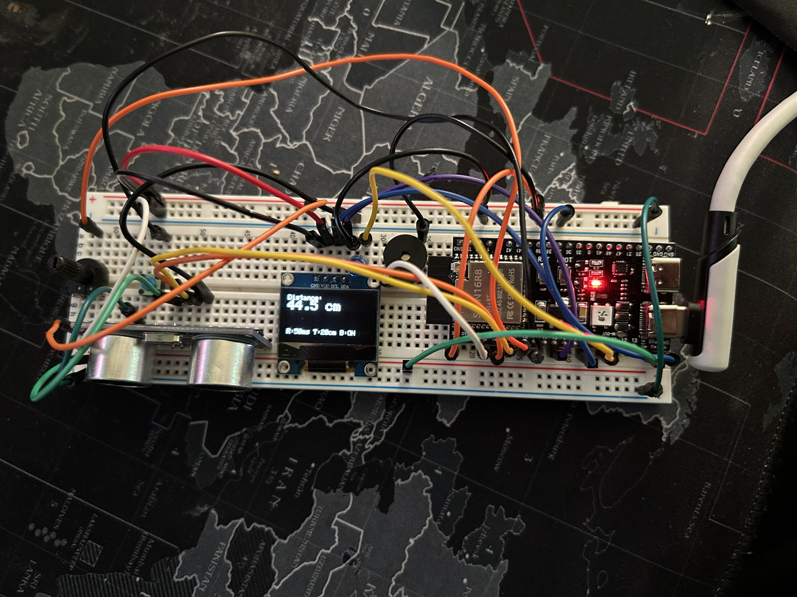
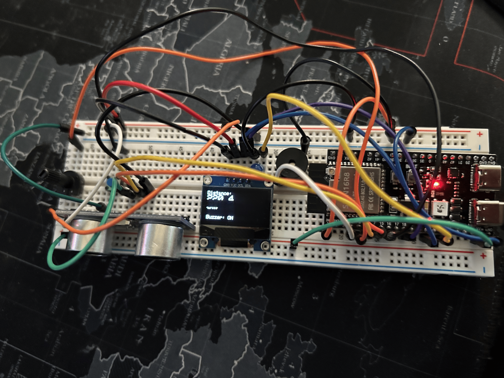
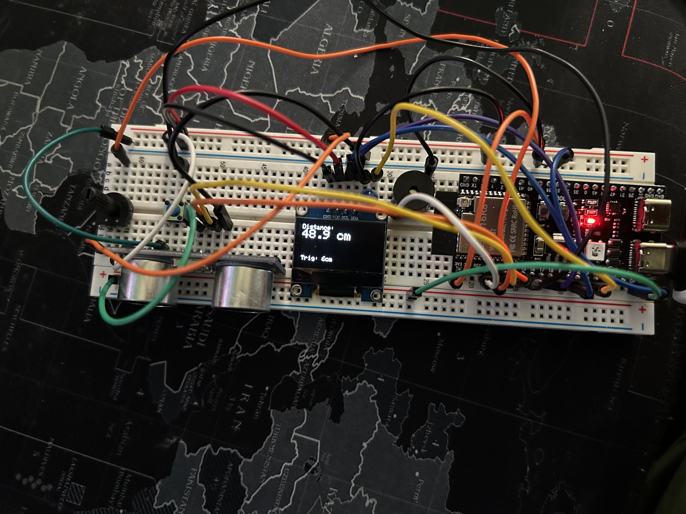

# EchoMeasure

ESP32-based distance measurement system with real-time OLED display and proximity alert.
  

---

## Overview

EchoMeasure measures distance using an ultrasonic sensor, displaying results on an OLED screen and outputting them over serial for external use.
It also includes a buzzer alert when objects are closer than the configured threshold.

**Use cases:**
- Obstacle detection
- Parking assistance
- Desk gadgets / interactive displays
- Basic robotics sensing

---

## Features

- Real-time distance measurement
- OLED display (SSD1306)
- Audible proximity alert (buzzer)
- Adjustable refresh rate
- Configurable trigger distance

---

## Hardware Setup
  
  
  

*Replace images if needed with higher-res versions.*

---

## Pin Configuration

| Component | ESP32 Pin |
|-----------|-----------|
| TRIG      | GPIO 5    |
| ECHO      | GPIO 6    |
| BUZZER    | GPIO 10   |
| OLED SDA  | GPIO 18   |
| OLED SCL  | GPIO 46   |

---

## Configuration

Adjust these variables in `EchoMeasureCode/esp32code.c++`:

```cpp
int RefreshRate = 50;   // Refresh interval (ms)
int TrigDistance = 20;  // Distance (cm) to trigger buzzer
